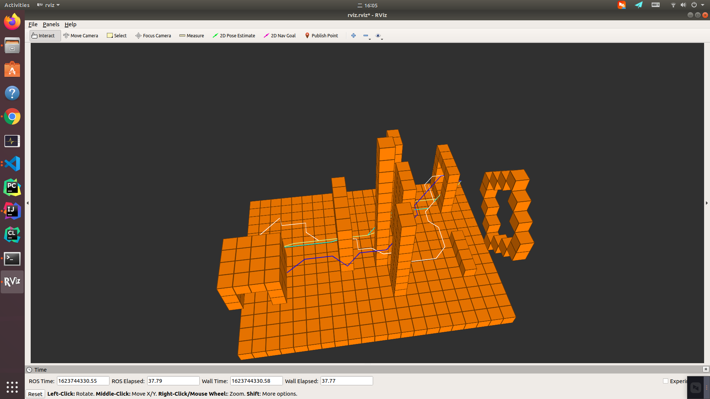
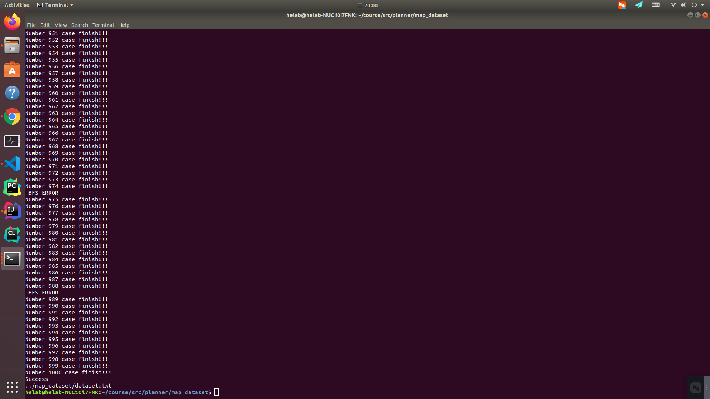
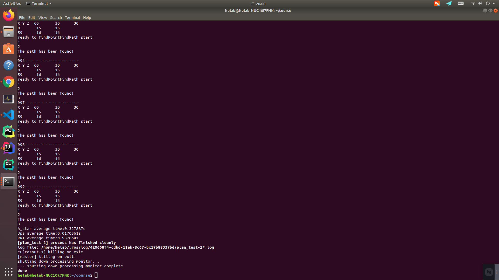

# Planner
运行在 **ubuntu18.04,16.04**系统下🐶
## Author
> * **@lymnxn(楼一旻)**
> * **@Ryan1997-tongji(陈哲炜)** 
> * **@lijie1998 (李杰)**
> * **@sleevemax2s1p(刘临池)**   
# How to start
快速启动
```
mkdir -p course/src
cd course/src
git clone https://github.com/sleevemax2s1p/Planner.git
cd ..
catkin_make
source devel/setup.bash
```
# How to launch
ROS启动文件 
```
roslaunch planner planner.launch
``` 
# 效果图

<p align="center">
  
  
</p>

# 协作实现
见文件头 **include/planner/planner.h** 
## 1. 像素点Point
```
struct Point{
    int x,y,z;
    int F,G,H;
    Point* parent;
    Point(int _x,int _y,int _z):x(_x),y(_y),z(_z),F(0),G(0),H(0),parent(NULL){};
    
};
```
其中：  
* x,y,z代表像素的三维信息
* G 路径从出发点到此像素点经过的距离
## 2. planner接口类 Abstract_planner
* 实现算法时继承头文件中的  **Abstract_planer**  
例如  `class A_star:public Abstract_planner`
* 并实现其中的虚方法 **getpath(Point *start_point,Point *end_point,double &time,int &distance)****
```
virtual std::list<Point*>* getPath(Point *start_point,Point *end_point,double &time,int &distance){};
``` 
* **start_point**初始点
* **end_point**目标点
* **time**用于存储规划所用时间  
* **distance**存储规划所得路径的长度
* `return` 由点组成的路径
# 地图表示
* 0代表无障碍物
* 1代表有障碍物
# 路径可视化
参考 **visualization.h**  
* 初始化`Init()`
* 绘制路径 `draw_path(std::list<Point*>path)`
```
void Visualization::Init()
void Visualization::draw_path(std::list<Point*>path)
``` 
# 大量数据测试
### 测试脚本
```
./map_dataset/map_generate.sh ${file_name}
```
<p align="center">
  
 
</p>

需要在test.cpp中修改测试数据集的来源
### 测试程序启动

```
roslaunch planner test.launch
```
<p align="center">
  

</p>